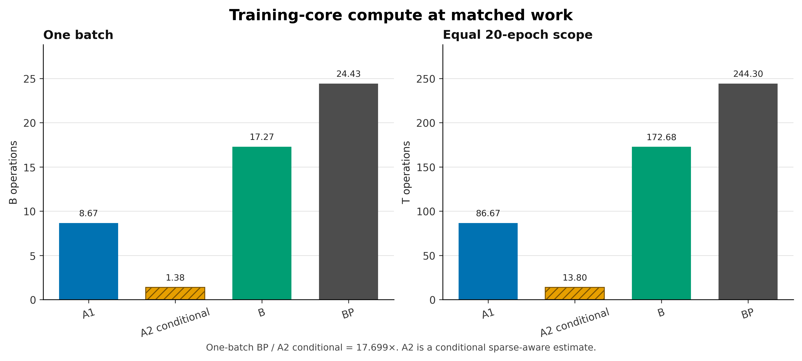
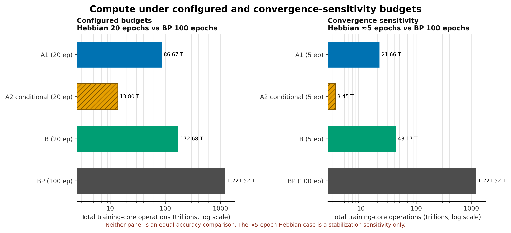
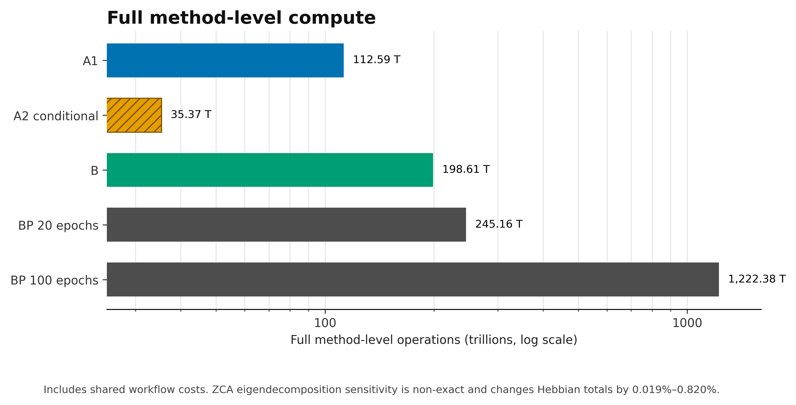
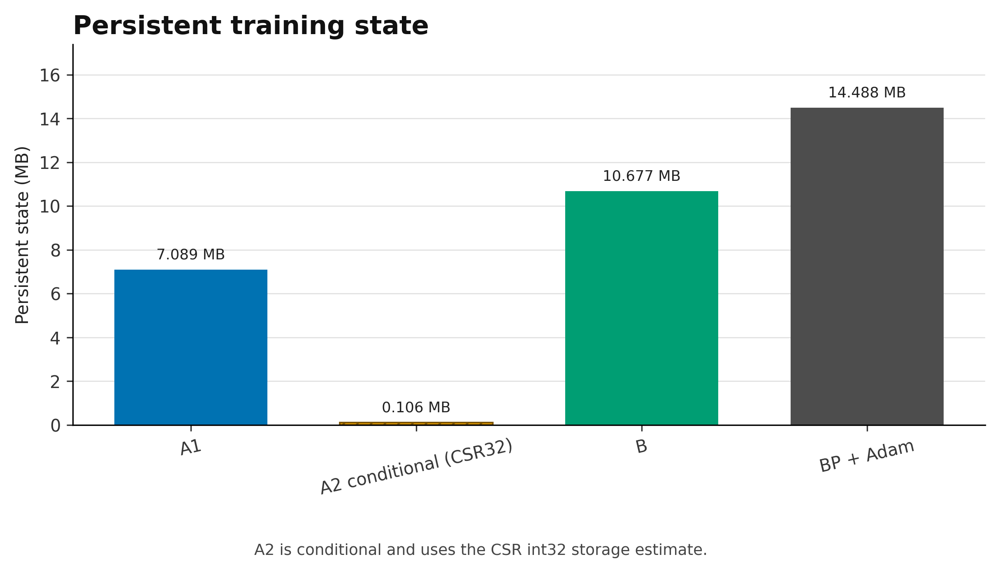
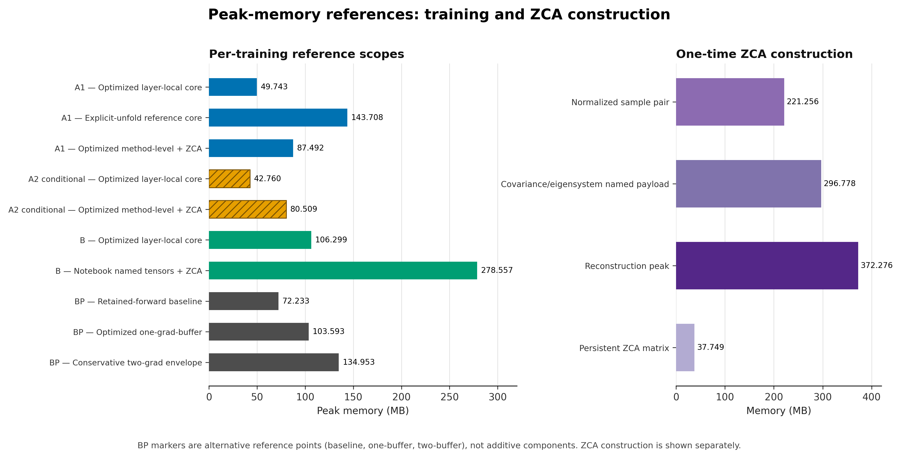
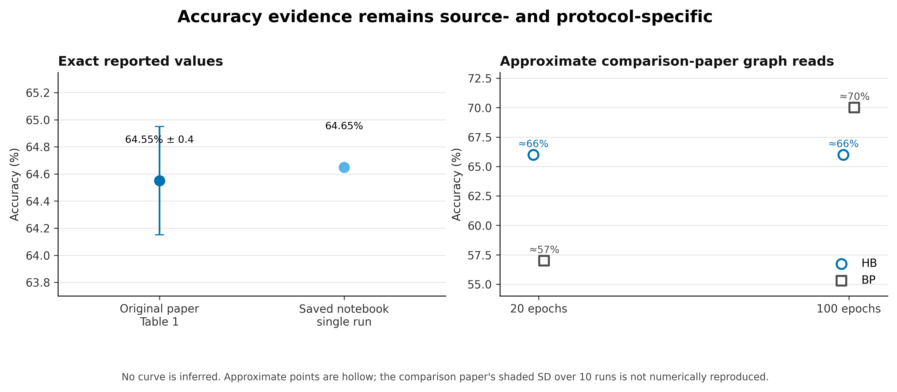

# Computational and Memory Analysis of a Hebbian Convolutional Neural Network

## A hardware-independent comparison of direct local learning, surrogate autograd, and backpropagation

**Final Project Report**  
**Author(s):** [Insert author/team name(s)]  
**Student ID(s):** [Insert student ID(s)]  
**Course / program:** [Insert course or program]  
**Instructor / supervisor:** [Insert name]  
**Dataset:** CIFAR-10  
**Implementation studied:** `HebbianCNNPyTorch`  
**Report date:** September 2026  
**Submission date:** [Insert submission date]

---

## Abstract

Backpropagation (BP) is the standard optimization method for deep neural networks, but its global backward pass, retained activations, gradients, and optimizer state can be computationally and memory intensive. Hebbian learning offers a biologically motivated alternative in which a synaptic update depends on local pre- and post-synaptic activity. This project asks a narrower and more testable question than whether Hebbian learning is universally "better": for one concrete three-layer CIFAR-10 Hebbian convolutional network, what arithmetic and memory resources are implied by the implemented learning rule, and how do they compare with an explicitly defined BP reference?

We audited the original notebooks, derived the Grossberg Instar update implemented through a PyTorch surrogate loss, and verified a direct local update against the surrogate/autograd mechanism on a deterministic three-layer batch. We then constructed three Hebbian analytical models: A1, a verified direct dense implementation; A2 conditional, a sparse-aware implementation; and B, the current dense surrogate/autograd notebook implementation. An equal-architecture BP reference was created from the limited BP facts reported by Gupta et al. and a documented set of architectural, activation, loss, and optimizer assumptions. Scalar multiplications, additions/subtractions, comparisons, divisions, square roots, and transcendental evaluations were counted separately. Persistent tensor state, analytical peak tensor payloads, one-time ZCA construction, and logical tensor movement were also modeled.

Direct electricity measurement was not used because no controlled hardware, kernel, runtime, power-sampling, or wall-clock experiment was performed. Operation counts and tensor bytes are therefore hardware-independent proxies, not joules or measured energy. At equal one-batch scope, the frozen models contain 8.667 billion operations for A1, 1.380 billion for A2 conditional, 17.268 billion for B, and 24.430 billion for BP. The one-batch BP/A2 conditional ratio is 17.699x. Full method-level 20-epoch totals are 112.590 trillion for A1, 35.365 trillion for A2 conditional, 198.609 trillion for B, and 245.158 trillion for 20-epoch BP; 100-epoch BP is 1.222 quadrillion. Persistent state is estimated at 7.089 MB for A1, 0.106 MB for A2 conditional with CSR32, 10.677 MB for B, and 14.488 MB for BP with Adam.

The results show that local direct updates can remove much of the arithmetic and state associated with a global backward pass, while the current autograd implementation captures only part of that potential advantage. The largest savings belong to A2 conditional and require genuine sparse storage and kernels. Accuracy evidence also prevents a simple efficiency winner: the original paper reports 64.55% ± 0.4 over ten runs, the saved notebook records 64.65% for one run, and approximate comparison-paper graph reads place full-data BP above Hebbian learning at 100 epochs. Consequently, the study supports a computational-resource advantage for direct local learning under the stated models, but not a claim of lower electricity use, equal accuracy, or overall algorithmic superiority.

**Keywords:** Hebbian learning, Grossberg Instar, backpropagation, convolutional neural networks, computational cost, memory, sparsity, CIFAR-10

---

## 1. Introduction

Modern convolutional neural networks are usually trained with backpropagation. A forward pass computes activations and a loss; a backward pass propagates derivatives through the network and accumulates parameter gradients; an optimizer then updates the parameters. This procedure is effective and general, but its learning signal is global: an early layer cannot complete its update until downstream computation and the loss derivative are available. Implementations therefore retain information from the forward pass and allocate gradient and optimizer state that do not appear in the inference-only network.

Biologically inspired learning investigates alternatives to this global mechanism. Hebbian learning is organized around the principle that a connection changes according to activity at its two ends. In its simplest form, the update is proportional to the product of input and output activity. More stable variants add competition, normalization, or a decay term. Grossberg's Instar rule, used in the repository studied here, moves a winning neuron's weight vector toward its current input:

```text
Delta w_c = eta * sum_m y_(m,c) * (x_m - w_c)
```

Here `x_m` is an input patch, `y_(m,c)` indicates whether channel `c` wins at spatial location `m`, and `eta` is the learning rate. The update is local in the algorithmic sense: it uses the receptive-field input, the channel's response or winner indicator, and the channel's own weights. It does not require a label-derived error to traverse later layers.

Miconi showed that convolutional Hebbian rules can be expressed as gradients of carefully chosen surrogate losses, allowing standard deep-learning frameworks to execute them efficiently [1]. The associated repository contains a full CIFAR-10 implementation and simpler notebooks that demonstrate and check the construction [3]. Gupta et al. later compared BP with several biologically inspired algorithms under limited-data, limited-epoch, noise, and pruning scenarios [2]. Their CIFAR-10 results motivate a resource comparison, particularly because Hebbian accuracy stabilizes early in their plots.

The practical question, however, is easy to overstate. A lower arithmetic count is not automatically lower energy, and earlier stabilization is not automatically equal accuracy. Moreover, an autograd implementation of a local rule may perform work that a purpose-built local implementation would avoid. This project therefore focuses on a concrete, auditable question:

> For the active Hebbian CIFAR-10 CNN in `HebbGrad_Github.ipynb`, what compute, persistent-state, working-memory, and logical-movement costs follow from (i) a verified direct dense Instar implementation, (ii) a conditional sparse-aware direct implementation, and (iii) the current surrogate/autograd implementation, compared with an explicitly documented equal-architecture BP reference?

The contribution is an implementation-grounded analytical audit rather than a new training experiment. Specifically, the project:

1. traces the active architecture and learning branches in the notebooks;
2. derives the surrogate gradient and verifies a direct Instar update numerically on a deterministic three-layer batch;
3. defines A1, A2 conditional, and B Hebbian execution models;
4. defines a BP reference while separating paper facts from fairness assumptions;
5. counts scalar operation categories over matched work, configured budgets, convergence sensitivity, and fuller method-level scopes;
6. models persistent state, peak tensor payload references, ZCA construction, and logical tensor movement; and
7. places these resource results beside source-qualified accuracy evidence without constructing an artificial efficiency score.

This scope is intentionally narrower than benchmarking runtime or power. No claim in this report converts operations into joules, bytes into electricity, or tensor payload into a measured GPU peak.

## 2. Background and Related Work

### 2.1 Backpropagation and global credit assignment

Backpropagation applies the chain rule to compute how a final loss changes with every trainable parameter. For a convolutional layer this normally entails, in addition to the forward convolution, a weight-gradient convolution-like accumulation and an input-gradient propagation for all but the first layer. Nonlinearities and pooling require backward operations, and the optimizer applies its own parameter-wise arithmetic. In the BP reference used here, Adam stores two moment tensors per parameter in addition to gradients and parameters.

The main relevance to this project is not biological plausibility by itself. It is that global reverse-mode differentiation imposes a characteristic resource structure: forward information must remain available until backward consumption, gradient tensors exist for trainable parameters and activations, and adaptive optimizers add persistent state. These requirements motivate a careful comparison with a layer-local update.

### 2.2 Hebbian convolutional learning in Miconi

Miconi's paper addresses the difficulty of applying Hebbian rules to convolutional weights, whose inputs are overlapping image patches [1]. The paper presents surrogate losses whose gradients implement plain Hebbian, Grossberg Instar, and Oja updates. The network's actual output may include non-differentiable operations such as winner-take-all (WTA); the surrogate expression establishes a computation graph, after which its forward value is replaced with the actual WTA output before differentiation.

The paper applies this mechanism to CIFAR-10. Its three convolutional layers contain 100, 196, and 400 filters. Layer 1 uses a 5x5 kernel and layers 2 and 3 use 3x3 kernels. Each layer is followed by 2x2 average pooling. WTA activity determines plasticity, while a denser triangle representation is propagated between layers and used for evaluation. Massive random pruning between higher layers and the triangle representation improve the information retained by later layers. The trained convolutional network is frozen and evaluated with a linear regression decoder [1].

Two aspects are central to the present work. First, the surrogate loss is an implementation mechanism, not evidence that the underlying learning rule requires a conventional end-to-end loss. Second, the repository's current dense autograd execution and a purpose-built direct local implementation can realize the same local update while having different operation and memory costs.

### 2.3 Grossberg Instar

For channel `c`, input patch `x_m`, and plasticity activity `y_(m,c)`, Grossberg Instar is

```text
Delta w_c = eta * sum_m y_(m,c) * (x_m - w_c)
          = eta * [sum_(m in wins(c)) x_m - N_wins(c) * w_c].
```

With binarized top-1 WTA, `y_(m,c)` is either zero or one, but "top-1" describes the cutoff selection rather than a guarantee of exactly one active channel. The active implementation retains every thresholded response equal to the top-1 cutoff and then binarizes only strictly positive values. A spatial column therefore has zero winners when its maximum thresholded response is non-positive, and it can have multiple winners when positive responses tie at the cutoff. Only channels that survive both conditions receive the patch contribution. This sparsity is algorithmic even when tensors are stored densely. Structural masks in layers 2 and 3 add a second kind of sparsity: only approximately one percent of possible higher-layer weights are permitted to remain nonzero.

The direct form exposes why local execution may be cheaper. A direct implementation can accumulate a patch only into its winning filter, compute the decay term once per filter, update that layer, and dispose of local intermediates. The notebook instead asks PyTorch autograd to recover the same update from a dense graph.

### 2.4 Gupta et al. comparison study

Gupta et al. compare Hebbian learning, feedback alignment, direct feedback alignment, difference target propagation, predictive coding, and BP [2]. For their vision experiments, all methods use three convolutional layers with 100, 196, and 400 neurons, followed by a linear layer for BP-like methods or a Ridge classifier for Hebbian learning. Their stated BP settings include Adam, batch size 100, initial learning rate `1e-5`, a StepLR schedule with step size 1, and 20- or 100-epoch budgets. They also state that the networks are vanilla, without batch normalization, dropout, or other training tricks.

Their CIFAR-10 Figure 2 plots means with shaded standard deviations over ten runs. Hebbian learning stabilizes in about five epochs, whereas BP continues improving toward the 100-epoch endpoint. This is evidence about convergence or stabilization speed, not equal accuracy: in the full-data plots, the approximate endpoints are about 66% for Hebbian learning at both 20 and 100 epochs, about 57% for BP at 20 epochs, and about 70% for BP at 100 epochs.

The comparison paper does not fully specify kernels, strides, pooling, BP activations, bias choices, loss reduction, Adam beta/epsilon values, StepLR gamma, or BP preprocessing. Those omissions matter for operation counting and are handled explicitly in Section 5.

## 3. System and Architecture

### 3.1 Active workflow

The active system is the full `HebbGrad_Github.ipynb` CIFAR-10 configuration. It performs four conceptually distinct stages:

1. **ZCA construction.** The notebook forms a 3072x3072 whitening matrix from one shuffled batch of 9,000 images. After per-image centering and standardization, it computes `T^T T / t.shape[1]`; because `t` has shape 9000x3072, the divisor is 3,072 features rather than 9,000 samples. The resulting matrix is therefore a scaled scatter-matrix construction rather than the conventional sample covariance. This also differs from the original paper's statement that ZCA is computed over the entire training set.
2. **Hebbian feature learning.** Twenty epochs process the 50,000 training images in batches of 100. Updates begin only after a 201-batch burn-in.
3. **Feature collection.** One pass over all 50,000 training images and one pass over all 10,000 test images collect the final pooled representation. Convolutional weights no longer update, although adaptive thresholds continue to change.
4. **Linear evaluation.** The final 400x2x2 tensor is flattened to 1,600 features. Default `sklearn.linear_model.Ridge()` is fitted to one-hot training targets; ten predicted scores are reduced by `argmax` for test accuracy.

The test transform includes a random horizontal flip, so the saved notebook result is not a deterministic benchmark even when the learned weights are fixed.

### 3.2 Architecture

**Table 1. Active CIFAR-10 architecture and tensor geometry for batch size 100.**

| Stage | Input tensor | Operation | Output before pooling | Output after pooling | Trainable weights | Structural mask |
|---|---:|---|---:|---:|---:|---|
| Conv 1 | 100x3x32x32 | 100 filters, 5x5, valid, stride 1 | 100x100x28x28 | 100x100x14x14 | 7,500 | Dense |
| Conv 2 | 100x100x14x14 | 196 filters, 3x3, valid, stride 1 | 100x196x12x12 | 100x196x6x6 | 176,400 | 99% masked |
| Conv 3 | 100x196x6x6 | 400 filters, 3x3, valid, stride 1 | 100x400x4x4 | 100x400x2x2 | 705,600 | 99% masked |
| Readout | 100x1,600 | Ridge to 10 one-hot targets | 100x10 scores | - | 16,000 coefficients plus 10 intercepts | Dense |

The convolutional stack contains 889,500 dense weight coordinates. For the deterministic seeded masks used by the audit, 7,500 coordinates are active in layer 1, 1,771 in layer 2, and 7,142 in layer 3. Because the notebook uses dense tensors and dense `conv2d`, masked zeros do not automatically reduce its convolutional arithmetic.

### 3.3 Competition, representation, and homeostasis

Each layer first normalizes every sample over its channel and spatial dimensions. A valid convolution produces pre-activations, and a learned per-channel threshold is subtracted. Plasticity then uses a binarized top-1 cutoff: responses below the selected cutoff are zeroed, followed by strict-positive binarization. This can produce zero active channels when the maximum thresholded response is non-positive or multiple active channels when positive responses tie at the cutoff. The target firing rate is `1/C`, where `C` is the number of output channels. Thresholds are adjusted toward this target to reduce dead units.

The representation passed to the next layer is not the binary WTA tensor. Instead, the mean thresholded response across channels is subtracted and negative values are rectified:

```text
triangle_(m,c) = max(0, z_tilde_(m,c) - mean_c(z_tilde_m)).
```

This triangle representation is followed by 2x2 average pooling. The distinction is important: sparse WTA activity controls plasticity, while a denser continuous activation carries information forward and supplies the final 1,600-dimensional readout.

## 4. Hebbian Implementation Analysis

### 4.1 Surrogate autograd mechanism

For a filter `w_c` and patch `x_m`, let the linear convolution output be `z_(m,c) = w_c^T x_m`. The notebook constructs

```text
y_forgrad_(m,c) = z_(m,c) - 0.5 * ||w_c||_2^2
L = -0.5 * sum_(m,c) y_forgrad_(m,c)^2.
```

Its derivative is

```text
d y_forgrad_(m,c) / d w_c = x_m - w_c,
dL / dw_c = -sum_m y_forgrad_(m,c) * (x_m - w_c).
```

Before `backward()`, the notebook replaces the forward value of `y_forgrad` with the binary WTA tensor while retaining the original graph. SGD therefore applies

```text
Delta w_c = eta * sum_m y_WTA_(m,c) * (x_m - w_c),
```

which is Grossberg Instar. The global-looking `loss.backward()` is thus a convenient way to ask PyTorch for a local update; it does not make the mathematical learning signal equivalent to supervised BP.

### 4.2 Deterministic equivalence test

`direct_hebb_equivalence_test.py` compares two implementations on the same deterministic float32 batch:

- the notebook-style surrogate expression, value replacement, autograd, and SGD step;
- a direct Instar accumulation without autograd.

The test includes all learning-relevant active branches: per-sample normalization, the three convolutional shapes, top-1 binary WTA, triangle activations, average pooling, layer learning rates, seeded structural masks, filter normalization, and adaptive-threshold updates. It uses a post-burn-in batch because an initial burn-in batch would perform no optimizer step and would not test update equivalence.

For all three layers, the test reports zero maximum and mean absolute differences for both updated weights and thresholds within `atol=1e-6` and `rtol=1e-5`. It also verifies the expected shapes. This particular deterministic batch happened to produce exactly one positive WTA entry per spatial column; that observation is not a generic property of the active cutoff-and-binarization implementation. This establishes numerical equivalence for the tested batch and branches. Together with the algebra above, it supports the direct-update model. It does **not** demonstrate a complete A1 or A2 conditional training run, reproduce end-to-end accuracy, validate sparse kernels, or prove that every stochastic trajectory is bitwise identical.

### 4.3 Three Hebbian execution models

**A1 - verified direct/local dense model.** A1 uses dense weights and dense forward convolutions but computes Instar directly. It therefore removes the surrogate graph, dense convolution weight-gradient, and parameter-gradient buffers. The active structural mask is still applied densely in layers 2 and 3. A1 is the strongest model directly supported by the update equivalence test while retaining conventional dense convolution.

**A2 conditional - sparse-aware direct/local model.** A2 conditional applies the same Instar mathematics but assumes sparse storage for the masked higher-layer filters and specialized kernels that skip every masked coordinate during convolution, accumulation, masking, and normalization. Layer 1 remains dense. The model remains conditional: neither the notebook nor standard dense `conv2d` realizes these savings automatically, and the project did not implement or benchmark such kernels.

**B - current surrogate/autograd model.** B represents the active notebook mechanism: dense forward convolution, surrogate expression and loss, dense autograd weight-gradient computation, SGD update, dense masks, filter normalization, and threshold adaptation. It remains Hebbian in its mathematical update, but its execution includes reverse-mode machinery introduced for implementation convenience.

Keeping these models separate prevents two common errors: calling the current notebook a hand-optimized local implementation, and attributing hypothetical sparse savings to dense PyTorch execution.

## 5. Backpropagation Reference

The comparison paper supplies enough information to define the broad BP experiment but not enough to reconstruct every tensor operation. We therefore created `backprop_reference.py` as a deterministic smoke-tested reference and `backprop_compute_cost.py` as its analytical count. The reference has 905,510 trainable parameters and produces a 10-way output from the same 400x2x2 final geometry.

**Table 2. BP evidence boundary: paper-direct facts versus analytical assumptions.**

| Item | Status | Treatment in this project |
|---|---|---|
| Dataset and channel counts | Paper-direct | CIFAR-10; convolutional channels 100/196/400 |
| Final BP classifier | Paper-direct | Trainable linear classifier |
| Optimizer | Paper-direct | Adam |
| Batch size and initial learning rate | Paper-direct | 100 and `1e-5` |
| Epoch budgets | Paper-direct | 20 or 100 epochs |
| LR schedule | Partly paper-direct | StepLR step size 1 is stated; gamma 0.95 is an assumption |
| Regularization architecture | Paper-direct | No batch normalization, dropout, or other training tricks |
| Kernels, stride, pooling | Not specified for BP | Reuse Hebbian 5x5/3x3/3x3 valid convolutions and 2x2 average pooling for architectural equality |
| Activation | Not specified | ReLU after each convolution |
| Convolutional biases | Not specified | Disabled to match Hebbian convolutions |
| Classifier bias | Not specified | Enabled |
| Loss | Not specified | Mean cross-entropy |
| Adam beta/epsilon and variants | Not specified | PyTorch defaults: beta1=0.9, beta2=0.999, epsilon=`1e-8`, no weight decay, no AMSGrad |
| BP preprocessing | Not specified | Excluded from the matched training-core comparison |

The reference was smoke-tested with deterministic input: all intermediate feature shapes matched Table 1, the output shape was `(2,10)`, the loss was finite, and a backward/Adam step completed. The smoke test validates implementation consistency, not the comparison paper's hidden code.

Post-training pruning in Gupta et al. does not reduce the dense BP training counts here. Their pruning experiment trains the network first and then removes weights by global magnitude before remeasuring accuracy. By contrast, A2 conditional assumes sparse execution during training.

## 6. Computational-Cost Methodology

### 6.1 Why operation counts rather than electricity

Electricity depends on hardware, precision, clocking, kernel selection, memory hierarchy, parallel utilization, compiler and library versions, cooling and power-delivery overhead, and measurement protocol. None of these variables was experimentally controlled in this project. Converting a scalar operation into a fixed energy constant would create false precision.

Instead, the analysis counts scalar work implied by explicit reference formulas. This is hardware-independent and reproducible, but it is not a timing or energy model. A fused GPU kernel may issue fewer instructions than the scalar expansion; another implementation may move more data or launch more kernels. The correct interpretation is comparative algorithmic workload under shared counting conventions.

### 6.2 Counted categories

The models track:

- multiplications;
- additions and subtractions;
- comparisons;
- divisions;
- square roots; and
- for BP cross-entropy, exponential and logarithmic evaluations as transcendental operations.

"Basic FLOPs" means multiplications plus additions/subtractions. "Total scalar operations" adds all listed categories with unit weight. That aggregation is convenient for tables, but it does not imply that a square root, comparison, division, and multiplication have equal latency or energy on real hardware.

Dense convolution is expanded as one dot product per output activation. With `A` output activations and input dimension `D`, it uses `A*D` multiplications and `A*(D-1)` additions. Top-1 competition uses `C-1` comparisons per spatial column. A 2x2 average-pooling output uses three additions and one division. Normalization is modeled with a centered two-pass scalar convention rather than a library-specific fused kernel.

For BP, the model includes forward convolution, ReLU, pooling, pooling backward, ReLU backward, convolutional weight gradients, convolutional input gradients where required, the linear classifier, stable mean cross-entropy, and Adam. The Adam reference counts six multiplications, four additions/subtractions, three divisions, and one square root per parameter.

### 6.3 Burn-in and representative-batch assumptions

The notebook initializes `nbbatches` at -1 and updates weights only when `nbbatches > 200`. Therefore the 20-epoch schedule contains 10,000 batches but 9,799 optimizer-update batches. Forward, normalization, competition, triangle, pooling, and threshold work still occur during burn-in; weight-update, mask, and normalization work follow the source branch schedule.

Winner-dependent direct Instar counts use the deterministic reference batch, which happened to contain exactly one positive WTA winner at every spatial column. The generic implementation can instead produce zero winners for a non-positive maximum or multiple winners for a positive tie at the cutoff. Epoch totals retain the frozen assumption that the deterministic batch's winner count is representative, and A2 conditional also assumes that the reference pairing between winners and nonzero mask coordinates is representative. These are analytical estimates, not measurements of every training batch; this wording correction does not alter the frozen counts.

### 6.4 Comparison scopes

The project reports several scopes because no single total answers every question:

1. **Representative one batch.** A post-burn-in training batch, with matched network geometry and preprocessing excluded from all methods in the direct BP comparison.
2. **Equal 20 epochs.** Each method processes 10,000 training batches. This is the cleanest equal-work training-core comparison.
3. **Configured budgets.** Hebbian learning uses its active 20 epochs while BP uses the comparison paper's 100-epoch budget. This is a protocol comparison, not equal accuracy.
4. **Convergence sensitivity.** Hebbian totals are scaled to approximately five epochs and compared with 100-epoch BP because Gupta et al. describe this stabilization pattern. This is explicitly **not** an equal-accuracy comparison.
5. **Full method-level subtotal.** Hebbian totals include known ZCA construction arithmetic, Hebbian training, 50,000-example training-feature collection, 10,000-example test-feature collection, Ridge fitting, and Ridge evaluation. BP totals include supervised training and a 10,000-example test pass.

### 6.5 ZCA and Ridge

The active notebook builds ZCA from 9,000 images with 3,072 features. After per-image centering and standardization, its code forms `T^T T` and divides by `t.shape[1] = 3072`, not by the 9,000 samples. The matrix entering regularization and eigendecomposition is therefore a scaled scatter matrix rather than a conventional sample covariance. The known arithmetic around normalization, this scaled scatter-matrix construction, diagonal regularization, inverse-square-root eigenvalue transformation, matrix reconstruction, and auxiliary projections is counted. The analytical operation counts follow the active code exactly, so this terminology correction changes no frozen total. The dense symmetric eigensolver is not assigned an exact count because `torch.symeig` does not fix the driver, reduction strategy, convergence behavior, or backend. Instead, a broad 4/3 F^3 to 10 F^3 sensitivity range is reported: 38,654,705,664 to 289,910,292,480 basic operations for `F=3072`. Adding this range changes the Hebbian method totals by only 0.019% to 0.820%, depending on the model, and does not change their ordering.

The notebook calls default `Ridge()` without pinning a scikit-learn version. The main analytical reference assumes a dense primal Cholesky path. The fit contributes 259,176,271,200 modeled operations and test prediction/evaluation contributes 320,110,000. These are defensible reference counts, not universal exact counts for every scikit-learn/SciPy version, dtype, solver dispatch, or copy strategy.

## 7. Memory and Resource Methodology

### 7.1 Persistent learning state

Persistent state is the payload that must remain across training steps. Depending on the method, it includes dense or sparse parameters, masks or sparse indices, parameter gradients, optimizer state, and Hebbian thresholds. Values are decimal MB and assume FP32 tensor values. A2 conditional uses FP32 values plus int32 CSR column indices and row pointers for higher-layer sparse filters.

A1 needs dense weights, higher-layer masks, and thresholds but no gradient or optimizer tensors. B retains dense weights, dense masks, parameter gradients, and thresholds. BP retains parameters, gradients, and two Adam moment tensors. These differences expose an advantage of local direct updates that is separate from operation count.

### 7.2 Working-memory references

Peak-memory figures are analytical liveness inventories, not allocator measurements. A1 and A2 conditional can update one layer and discard local learning intermediates before proceeding. B must support the surrogate graph and autograd payloads. BP must retain forward information until a global backward pass and requires transient activation-gradient storage.

The BP values are alternative references rather than additive terms:

- retained-forward baseline;
- an optimized reference with one recycled largest activation-gradient buffer; and
- a conservative two-gradient-buffer envelope with no assumed early release of forward saves.

Actual PyTorch/cuDNN peaks can be lower through fusion and reuse or higher through convolution workspaces, autograd objects, allocator caching, and backend-specific temporaries.

### 7.3 ZCA construction and logical movement

ZCA construction is a one-time preprocessing phase and is kept separate from ordinary per-batch training. In the active code, the 9,000x3,072 normalized data matrix produces a 3,072x3,072 scaled scatter matrix through `T^T T / 3072`; it is not a conventional sample covariance divided by 9,000. The source-visible peak includes the sample tensors and multiple 3,072x3,072 matrices. Eigensolver and matrix-multiplication workspaces are not fixed by the source and remain excluded. After construction, ordinary Hebbian processing retains the 37.749 MB ZCA matrix rather than the full construction peak. The memory and operation models already follow this active implementation, so the clarified terminology changes no frozen value.

Logical tensor movement counts idealized whole-tensor reads and writes under the model's reuse assumptions. It is neither physical DRAM traffic nor a hardware bandwidth measurement. Cache behavior, tiling, fusion, sparse format conversion, transfers, and allocator behavior can substantially change actual traffic.

## 8. Results

### 8.1 Matched-work training-core compute



*Figure 1. Analytical training-core operations for one representative post-burn-in batch and for equal 20-epoch scope. A2 conditional is a sparse-aware model. Preprocessing is excluded consistently from the direct BP comparison.*

Figure 1 isolates the learning core under matched work. For one batch, A1 requires 8,667,340,084 scalar operations, A2 conditional requires 1,380,339,683, B requires 17,267,771,387, and BP requires 24,430,482,934. The corresponding equal-20-epoch totals are 86,666,040,782,800; 13,799,879,559,140; 172,677,356,291,000; and 244,304,829,340,020.

**Table 3. Headline matched-work training-core totals.**

| Method | One batch | Equal 20 epochs | Interpretation |
|---|---:|---:|---|
| A1 direct dense | 8,667,340,084 | 86,666,040,782,800 | Verified direct update, dense convolution |
| A2 conditional sparse-aware | 1,380,339,683 | 13,799,879,559,140 | Requires genuine sparse storage and kernels |
| B surrogate/autograd | 17,267,771,387 | 172,677,356,291,000 | Current dense notebook execution model |
| BP | 24,430,482,934 | 244,304,829,340,020 | Equal-architecture analytical reference |

The one-batch BP/A1 ratio is about 2.819, BP/A2 conditional is 17.699, and BP/B is about 1.415. The result explains two different effects. First, direct Instar avoids much of BP's backward and Adam work. Second, the current surrogate/autograd implementation B spends substantially more than A1 because it expresses the local rule through dense reverse-mode machinery. A2 conditional gains a further large reduction only by treating structural zeros as absent work.

These are arithmetic comparisons, not runtime or electricity measurements. A dense GPU convolution may be highly optimized, while an irregular sparse kernel may have lower operation count but poorer utilization.

### 8.2 Training budgets and convergence sensitivity



*Figure 2. Training-core totals under configured Hebbian-20/BP-100 budgets and under the Hebbian-approximately-5/BP-100 convergence sensitivity. The logarithmic axis supports scale comparison. Neither panel is accuracy matched.*

At configured budgets, 100-epoch BP requires 1,221,524,146,700,100 modeled operations, compared with 86,666,040,782,800 for A1, 13,799,879,559,140 for A2 conditional, and 172,677,356,291,000 for B at 20 epochs. The BP totals are therefore about 14.095 times A1, 88.517 times A2 conditional, and 7.074 times B.

If the comparison paper's qualitative stabilization statement is applied as a sensitivity budget, five-epoch Hebbian totals are 21,660,990,152,800 for A1, 3,447,331,936,640 for A2 conditional, and 43,169,070,888,500 for B. The 100-epoch BP total is then 56.393, 354.339, and 28.296 times larger, respectively. These ratios show how strongly training budget can dominate cumulative arithmetic. They must not be read as "Hebbian reaches BP's 100-epoch accuracy in five epochs": the source accuracy plot does not support that claim.

### 8.3 Full method-level compute



*Figure 3. Full method-level analytical subtotals. Hebbian rows include known ZCA arithmetic, 20 training epochs, post-training train/test feature extraction with convolutional weights frozen while adaptive thresholds continue to update, Ridge fitting, and evaluation. The ZCA eigensolver is treated separately as a sensitivity range.*

The fuller scope produces 112,590,041,834,287 operations for A1, 35,365,252,130,627 for A2 conditional, and 198,609,206,182,487 for B. BP totals are 245,157,703,690,020 at 20 epochs and 1,222,377,021,050,100 at 100 epochs.

Adding feature extraction and Ridge narrows the gap between the direct Hebbian training core and the overall method because those downstream stages are shared by all three Hebbian execution models. Even so, the ordering is unchanged. The B subtotal remains below 20-epoch BP, but much closer than A1 and especially A2 conditional. The omitted eigensolver sensitivity is too small relative to these totals to reverse any comparison.

The method-level table is not a claim that the pipelines are statistically identical. Hebbian evaluation uses post-training feature extraction with convolutional weights frozen while adaptive thresholds continue to update, followed by Ridge; BP uses a learned linear output in end-to-end supervised training. The totals describe their source-appropriate workflows.

### 8.4 Persistent state



*Figure 4. Persistent tensor payloads in decimal MB. A2 conditional uses a CSR32 sparse representation; BP includes parameter gradients and two Adam moment tensors.*

Persistent state is estimated at 7.089 MB for A1, 0.106 MB for A2 conditional, 10.677 MB for B, and 14.488 MB for BP. The A2 conditional figure is a total persistent-state value: it includes sparse parameter-representation storage, CSR metadata, and Hebbian thresholds. The BP total is driven by 3.622 MB of parameters, 3.622 MB of gradients, and 7.244 MB of Adam moments. B needs dense parameter gradients because autograd is used, even though the mathematical rule is local. A1 removes those gradients but still stores dense weights and higher-layer masks. A2 conditional is small because it stores only active higher-layer values and CSR metadata in addition to its thresholds.

The A2 conditional value depends not merely on one-percent density but on a complete sparse implementation. The approximately 0.104 MB CSR32 figure is sparse parameter-representation storage only. Adding the Hebbian thresholds gives the approximately 0.106 MB total persistent state reported for A2 conditional. Alternative parameter representations in the audit reach 0.351 MB for generic four-dimensional COO with int64 indices. These formats can also affect compute and movement differently.

### 8.5 Peak-memory references and ZCA construction



*Figure 5. Left: analytical per-training peak tensor-payload references for A1, A2 conditional, B, and BP. Right: separate one-time ZCA construction payloads. BP points are alternative references, not additive components.*

The optimized layer-local core references are 49.743 MB for A1 and 42.760 MB for A2 conditional. Adding the persistent ZCA matrix gives method-level references of 87.492 MB and 80.509 MB. An explicit-unfold A1 reference reaches 143.708 MB, illustrating that direct mathematics does not guarantee a low-memory implementation if patches are materialized.

B has a 106.299 MB optimized layer-local reference, while the current notebook's named tensors plus ZCA reach 278.557 MB before unknown allocator, autograd, and convolution workspaces. BP's retained-forward baseline is 72.233 MB; adding one recycled activation-gradient buffer yields 103.593 MB, and the conservative two-buffer envelope is 134.953 MB.

The ZCA construction stage is larger than these ordinary training references: 221.256 MB for the normalized sample pair, 296.778 MB for the scaled-scatter/eigensystem named payload, and 372.276 MB at reconstruction. This does not mean every Hebbian batch uses 372.276 MB. Ordinary processing retains only the 37.749 MB ZCA matrix after construction.

### 8.6 Logical tensor movement

**Table 4. Idealized logical tensor movement per compared update batch.**

| Method | Logical movement | Qualification |
|---|---:|---|
| A1 direct dense | 239.950 MB | Representative winner-dependent reads |
| A2 conditional sparse-aware | 139.038 MB | Requires sparse storage and kernels |
| B surrogate/autograd | 377.999 MB | Dense graph and gradients included |
| BP + Adam | 366.434 MB | Dense backward and optimizer state included |

B's modeled logical movement is slightly above BP even though B's scalar-operation count is lower. This is a useful reminder that arithmetic and data movement are different axes. A1 and A2 conditional avoid global-gradient traffic, but their real performance would still depend on locality, fusion, cache behavior, and sparse access patterns. None of the values in Table 4 is measured DRAM traffic.

## 9. Accuracy and Performance Context



*Figure 6. Exact values from the original paper and saved notebook are separated from approximate graph reads in the comparison paper. Hollow markers denote approximate reads; no intermediate curve is inferred.*

Accuracy evidence comes from different artifacts and protocols and must not be pooled as though it were one experiment.

**Table 5. CIFAR-10 accuracy evidence used in this report.**

| Source | Method and scope | Epochs | Accuracy | Runs | Evidence class |
|---|---|---:|---:|---:|---|
| Miconi, Table 1 [1] | Triangle + pruning, final 400x2x2 output | 20 | 64.55% ± 0.4 | 10 | Exact paper table value |
| Saved `HebbGrad_Github.ipynb` | Default Ridge on final 1,600 features | 20 | 64.65% | 1 | Exact saved run |
| Gupta et al., Fig. 2(b) [2] | Hebbian, 100% data | 20 | approximately 66% | 10 | Approximate graph read of plotted mean |
| Gupta et al., Fig. 2(b) [2] | BP, 100% data | 20 | approximately 57% | 10 | Approximate graph read of plotted mean |
| Gupta et al., Fig. 2(d) [2] | Hebbian, 100% data | 100 | approximately 66% | 10 | Approximate graph read of plotted mean |
| Gupta et al., Fig. 2(d) [2] | BP, 100% data | 100 | approximately 70% | 10 | Approximate graph read of plotted mean |

The original paper's table gives 64.55% ± 0.4 for the relevant condition. The prose below the table says ±0.5; this report follows the structured table and records the internal 0.1-point discrepancy as a limitation. The saved notebook's 64.65% is one realized run, not a mean or replication study.

The comparison-paper endpoints are deliberately rounded because the paper does not print those four CIFAR-10 values in a table. Its caption states that means and shaded standard deviations are based on ten runs, but the shading does not support a defensible numerical standard deviation. Figure 6 therefore shows approximate points without connecting lines.

The approximately-five-versus-100-epoch statement concerns stabilization. Hebbian accuracy is already near its plateau after a few epochs, while BP continues to improve. It does not mean the two methods reach the same accuracy. Indeed, the approximate full-data 100-epoch endpoints place BP near 70% and Hebbian learning near 66%. Training-budget compute comparisons must therefore remain separate from accuracy equivalence.

## 10. Discussion

### 10.1 Why direct local Hebbian arithmetic can be lower

BP computes a forward path, gradients for the classifier and every convolutional weight tensor, input gradients needed to propagate error, activation derivatives, and Adam updates. Direct Instar does not propagate a global error. With the active top-1 cutoff and strict-positive binarization, patch contributions go to every positive channel tied at the cutoff; a location contributes to none when its maximum thresholded response is non-positive. The deterministic reference batch happened to yield exactly one such channel per spatial location. The decay term can be aggregated per filter. A layer can update before later layers learn, allowing local intermediates to be discarded.

This structural difference explains why A1 is cheaper than BP even though both use dense forward convolutions. Most work in the network is still convolutional; locality does not eliminate the forward projection. It instead removes the global backward path and adaptive-optimizer arithmetic.

### 10.2 Optimized direct Hebbian versus current autograd

The comparison between A1 and B is as important as the comparison with BP. B uses a local mathematical rule, yet it asks a general reverse-mode engine to compute the update. The one-batch B count is nearly twice A1's, and B carries dense parameter gradients. This does not make the notebook incorrect. The surrogate method is elegant, concise, and gives access to mature GPU kernels. It does show that algorithmic locality and implementation locality are not the same thing.

A purpose-built implementation could exploit the direct update, layer-local liveness, and binary winner structure. Whether it would be faster on a specific GPU or CPU remains an empirical question because optimized dense libraries may outperform theoretically smaller irregular kernels.

### 10.3 Promise and conditions of A2 conditional

A2 conditional produces the lowest compute, persistent state, and logical movement in the analytical models. Layers 2 and 3 retain about one percent of their weight coordinates, so sparse execution can avoid most higher-layer multiply-accumulate work. Its 0.106 MB persistent state is particularly striking relative to dense A1, B, and BP.

Those results are an opportunity estimate, not current performance. Efficient unstructured sparse convolution is difficult: indices consume space, irregular access can reduce vectorization, and conversion or load imbalance can erase theoretical savings. A credible implementation study would need sparse kernels, a specified format, end-to-end numerical validation, measured runtime and memory, and accuracy replication.

### 10.4 Memory consequences of locality

Local learning changes when information must remain live. A direct Hebbian layer can form its winner statistics and update immediately. BP must retain or reconstruct forward information for the backward pass, and Adam adds two persistent moment tensors. B retains autograd-related state despite its local rule.

The results do not imply that every local algorithm has lower peak memory. The A1 explicit-unfold reference is larger than the optimized BP reference because materializing patches is expensive. Implementation strategy, not only the learning equation, determines the realized peak.

### 10.5 Training budget and accuracy tradeoff

Cumulative compute is highly sensitive to epoch count. A five-epoch Hebbian sensitivity total can be hundreds of times below 100-epoch BP under A2 conditional. Yet the accuracy evidence shows why this ratio cannot stand alone: BP continues improving and ends above Hebbian learning in the comparison paper's full-data 100-epoch plot.

For applications where early stable representations or limited training budgets matter, Hebbian learning may offer a useful operating point. For applications where the highest observed accuracy is the objective, additional BP compute may buy performance. The present evidence does not define a universal tradeoff curve because protocols, implementations, evaluation heads, and exact reported values differ.

### 10.6 What the project establishes

The strongest supported conclusion is conditional and implementation-specific. For this architecture and the frozen scalar formulas, direct local Instar requires fewer training-core operations than the equal-architecture BP reference at equal batch and equal 20-epoch scope. The current surrogate/autograd implementation also models fewer operations than BP, but the gap is smaller. Local direct execution can reduce persistent learning state, and conditional sparse execution can reduce it dramatically. These advantages persist in the broader method-level accounting.

The project does not establish that Hebbian learning is the better machine-learning method. It does not measure electricity, runtime, GPU utilization, or physical memory traffic. It does not show equal accuracy at the most favorable compute ratios, and it does not implement A2 conditional. The value of the work lies in making these boundaries explicit while turning an opaque implementation comparison into a reproducible set of equations, tests, data tables, and figures.

## 11. Limitations

1. **Analytical rather than electrical measurement.** No joules, watts, runtime, or hardware-counter data were collected. Scalar operations and bytes cannot be converted directly into electricity.
2. **Reference formulas rather than kernel instructions.** Convolution, normalization, pooling, autograd, and optimizer libraries may fuse operations or select algorithms different from the scalar expansion.
3. **Incomplete BP specification.** Gupta et al. do not state BP kernels, pooling, activation, bias, loss, Adam defaults, StepLR gamma, or preprocessing. The report labels the equalization assumptions rather than attributing them to the paper.
4. **A2 conditional.** A2 conditional assumes unstructured sparse storage and specialized kernels throughout training. It is not the behavior of the current dense notebook and has not been implemented end to end.
5. **Representative winner statistics.** Some A1 and A2 conditional update and movement totals extrapolate the deterministic reference batch's winner pattern.
6. **ZCA eigensolver uncertainty.** The backend and algorithm used by `torch.symeig` are not fixed. Its cost is a broad sensitivity range rather than an exact count.
7. **Ridge implementation dependence.** Default `Ridge()` is not version-pinned. Solver choice, dtype, centering, validation, and copies can change the actual cost and memory.
8. **Tensor payload is not allocator memory.** Peak references exclude Python objects, caching allocators, autograd bookkeeping, and many cuDNN or BLAS workspaces.
9. **Logical movement is not physical DRAM traffic.** The movement model assumes idealized passes and reuse. Cache lines, tiling, fusion, and sparse access determine actual traffic.
10. **Approximate comparison-paper accuracy.** Four CIFAR-10 endpoints are visual reads from plotted means. Their numerical standard deviations cannot be recovered from shading.
11. **Protocol differences.** The active notebook, original paper, comparison paper, and BP reference differ in preprocessing, learning rates, readout, and other details. Compute totals and accuracy values are therefore contextual rather than one controlled benchmark.
12. **Stochastic saved notebook.** The saved 64.65% result is one run. The test transform includes random horizontal flipping, and adaptive thresholds continue changing during feature collection.
13. **ZCA construction difference.** The original paper states that ZCA uses the full training set; the active notebook uses one shuffled 9,000-image batch. It also computes `T^T T / 3072`, dividing by the feature count rather than the 9,000 samples, so the construction is a scaled scatter matrix rather than a conventional sample covariance. The method-level model follows the active code, and this terminology correction changes no frozen total.
14. **Limited equivalence claim.** The deterministic test verifies one representative post-burn-in batch and active branches. It does not reproduce complete training or accuracy for A1 or A2 conditional.

## 12. Conclusion

This project investigated the computational and memory implications of a concrete Hebbian convolutional network rather than making a general biological or performance claim. The notebook's surrogate loss was shown algebraically to encode Grossberg Instar, and a deterministic test found numerically identical direct and autograd updates for all three layers on the tested batch. This justified separating the mathematics of local learning from the cost of its current framework implementation.

Under the frozen analytical model, A1 direct dense, A2 conditional sparse-aware, and B surrogate/autograd all require fewer training-core scalar operations than the equal-architecture BP reference at matched batch and 20-epoch scopes. Direct execution also reduces persistent state by eliminating parameter gradients and Adam moments; A2 conditional offers the largest resource savings if sparse storage and kernels are genuinely available. The full method-level analysis, including known ZCA and Ridge work, preserves the same ordering.

These results answer the research question with an important qualification: direct local Hebbian learning has a clear modeled resource advantage for this architecture, but that advantage is not evidence of measured energy reduction or overall learning superiority. The accuracy sources are not protocol-identical, and the most favorable five-versus-100-epoch comparison is a convergence sensitivity rather than an equal-accuracy result. A future hardware experiment should implement A1 and A2 conditional, hold the training and evaluation protocol fixed, measure runtime, allocator peak, DRAM traffic, and energy, and report accuracy distributions over repeated runs. Until then, the present report provides a rigorous hardware-independent baseline and an explicit map of what remains to be tested.

## References

[1] T. Miconi, "Hebbian Learning with Gradients: Hebbian Convolutional Neural Networks with Modern Deep Learning Frameworks," arXiv:2107.01729v2, 2021. https://arxiv.org/abs/2107.01729

[2] M. Gupta, S. K. Modi, H. Zhang, J. H. Lee, and J. H. Lim, "Is Bio-Inspired Learning Better than Backprop? Benchmarking Bio Learning vs. Backprop," arXiv:2212.04614v4, 2023. https://arxiv.org/abs/2212.04614

[3] T. Miconi, "HebbianCNNPyTorch," GitHub repository accompanying [1]. https://github.com/ThomasMiconi/HebbianCNNPyTorch

---

## Reproducibility and artifact map

The report is grounded in the following frozen project artifacts:

- architecture and code audit: `mathematical_architectural_audit.md`;
- deterministic update check: `direct_hebb_equivalence_test.py`;
- Hebbian arithmetic: `hebbian_compute_cost.py`;
- BP definition and smoke test: `backprop_reference.py`;
- BP arithmetic and matched comparisons: `backprop_compute_cost.py`;
- full-pipeline arithmetic: `method_level_compute_cost.py`;
- memory and movement: `memory_resource_cost.py`;
- accuracy evidence classification: `accuracy_performance_context.md`;
- graph source data: `results/data/*.csv`; and
- frozen figures: `results/figures/*`.

All figures used in this report are generated from the CSV source tables. The original notebooks remain unmodified.
