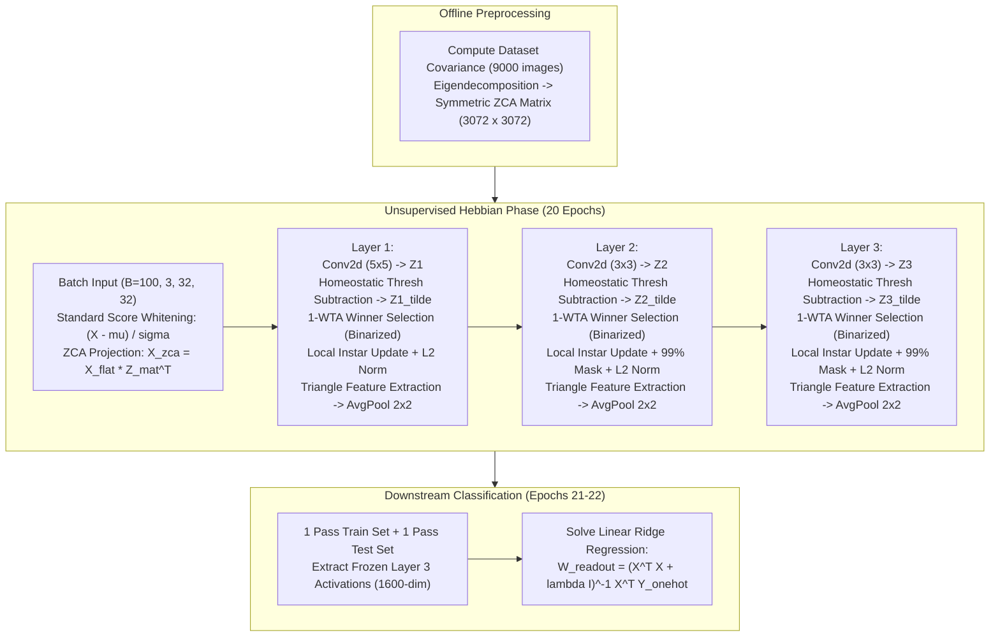

# Mathematical & Architectural Audit: Hebbian CNN (`HebbGrad_Github.ipynb`)

## 1. Executive Summary

This document establishes the exact architectural parameters, tensor shapes, and mathematical algorithms implemented in [`HebbGrad_Github.ipynb`](file:///c:/Users/shay1/Desktop/antigravity_sandbox/HebbianCNNPyTorch/HebbGrad_Github.ipynb).

The notebook uses PyTorch's native automatic differentiation (`loss.backward()`) on an artificial surrogate loss function as an implementation vehicle. This avoids writing custom CUDA kernels while running on GPUs. However, mathematically, the algorithm is a purely **forward-local Hebbian Instar learning rule**.

This document serves as the formal foundation for deriving the **Optimal Theoretical Compute Model** (Phase 2), which quantifies the minimal compute, memory bandwidth, and working memory required by a dedicated, purpose-built implementation of this exact network.

---

## 2. Layer-by-Layer Architectural & Dimensional Parameters

All parameters below are extracted directly from the executable configuration of `HebbGrad_Github.ipynb` on CIFAR-10 ($32 \times 32$ RGB images, 10 classes):
* **Mini-batch size ($B$)**: $100$
* **Unsupervised Hebbian epochs ($E_{\text{Hebb}}$)**: $20$
* **Readout evaluation passes**: $1$ training pass + $1$ testing pass for feature collection
* **Competition parameter ($K$)**: $K = [1, 1, 1]$ ($1$-WTA winner per spatial column)

### 2.1 Dimensional Specification Table

| Layer ($l$) | Input Shape $(B, C_{\text{in}}, H_{\text{in}}, W_{\text{in}})$ | Kernel $(K \times K, S)$ | Unrolled Patch $D = C_{\text{in}} K^2$ | Filter Count $C_{\text{out}}$ | Total Weights $N_{\text{params}}$ | Pre-Pool Activation $(B, C_{\text{out}}, H_{\text{out}}, W_{\text{out}})$ | Patches $M = B H_{\text{out}} W_{\text{out}}$ | Post-Pool Activation $(B, C_{\text{out}}, H_{\text{pool}}, W_{\text{pool}})$ | Structural Mask Sparsity |
| :--- | :--- | :--- | :--- | :--- | :--- | :--- | :--- | :--- | :--- |
| **Layer 1** | $(100, 3, 32, 32)$ | $5 \times 5, S=1$ | $75$ | $100$ | $7,500$ | $(100, 100, 28, 28)$ | $78,400$ | $(100, 100, 14, 14)$ | Dense ($0\%$) |
| **Layer 2** | $(100, 100, 14, 14)$ | $3 \times 3, S=1$ | $900$ | $196$ | $176,400$ | $(100, 196, 12, 12)$ | $14,400$ | $(100, 196, 6, 6)$ | $99\%$ Sparse |
| **Layer 3** | $(100, 196, 6, 6)$ | $3 \times 3, S=1$ | $1,764$ | $400$ | $705,600$ | $(100, 400, 4, 4)$ | $1,600$ | $(100, 400, 2, 2)$ | $99\%$ Sparse |
| **Readout** | $(100, 1600)$ | Linear Readout | $1,600$ | $10$ | $16,000$ | $(100, 10)$ | $100$ | N/A (One-hot logits) | Dense |

**Network Totals**:
* **Total Convolutional Parameters**: $889,500$ ($3.56 \text{ MB}$ in FP32)
* **Total Readout Parameters**: $16,000$ ($64 \text{ KB}$ in FP32)
* **Active Convolutional Weights (under $99\%$ mask)**: $7,500 + 1,764 + 7,056 = 16,320$ non-zero weights

---

## 3. Mathematical Trace of the Training Algorithm

The training process decomposes into three distinct stages:



### 3.1 Mathematical Operations per Mini-batch

For each layer $l \in \{1, 2, 3\}$:

1. **Input Normalization**:
   Each image in the mini-batch is normalized across its channels and spatial dimensions:
   $$X^{(l)} \leftarrow \frac{X^{(l)} - \mu_{X^{(l)}}}{\sigma_{X^{(l)}} + 10^{-10}}$$

2. **Forward Convolutional Response**:
   For each spatial patch location $m \in \{1, \dots, M^{(l)}\}$ and channel $c \in \{1, \dots, C_{\text{out}}^{(l)}\}$:
   $$z_{m, c} = w_c^T x_m$$
   where $x_m \in \mathbb{R}^{D^{(l)}}$ is the unrolled receptive field patch and $w_c \in \mathbb{R}^{D^{(l)}}$ is the filter weight vector.

3. **Homeostatic Threshold Subtraction & 1-WTA Plasticity Competition**:
   Let $\theta_c^{(l)}$ be the adaptive threshold for channel $c$. The thresholded response is:
   $$\tilde{z}_{m, c} = z_{m, c} - \theta_c^{(l)}$$
   The local competition selects the single highest-responding channel ($K=1$) at each spatial location $m$:
   $$c^*(m) = \arg\max_{c \in \{1, \dots, C_{\text{out}}\}} \tilde{z}_{m, c}$$
   The plasticity activation $Y_{\text{WTA}} \in \{0, 1\}^{M \times C_{\text{out}}}$ is strictly binarized:
   $$y^{\text{WTA}}_{m, c} = \begin{cases} 1 & \text{if } c = c^*(m) \text{ and } \tilde{z}_{m, c} > 0 \\ 0 & \text{otherwise} \end{cases}$$
   *Crucial Property*: Exactly one channel fires per spatial location. The activation density is:
   $$\alpha^{(l)} = \frac{1}{C_{\text{out}}^{(l)}} \quad \left(\alpha^{(1)} = 0.01, \; \alpha^{(2)} \approx 0.0051, \; \alpha^{(3)} = 0.0025\right)$$

4. **Grossberg Instar Weight Update**:
   For each filter $c$:
   $$\Delta w_c = \eta^{(l)} \sum_{m=1}^{M^{(l)}} y^{\text{WTA}}_{m, c} \left( x_m - w_c \right) = \eta^{(l)} \left( \sum_{m \in \text{wins}(c)} x_m - N_{\text{wins}}(c) \cdot w_c \right)$$
   where $N_{\text{wins}}(c) = \sum_{m} y^{\text{WTA}}_{m, c}$ is the number of patches won by filter $c$ in the mini-batch.

5. **Structural Masking & Filter Normalization**:
   If structural masks are active (`PROBAMASKS`):
   $$w_c \leftarrow w_c \odot \mathbf{m}_c, \quad \mathbf{m}_c \in \{0, 1\}^{D^{(l)}}$$
   Weights are constrained to the unit hypersphere:
   $$w_c \leftarrow \frac{w_c}{\|w_c\|_2 + 10^{-10}}$$

6. **Homeostatic Threshold Update**:
   Thresholds adapt based on the empirical firing rate of each channel over the mini-batch:
   $$r_c = \frac{N_{\text{wins}}(c)}{M^{(l)}}, \quad r^* = \frac{K}{C_{\text{out}}^{(l)}} = \frac{1}{C_{\text{out}}^{(l)}}$$
   $$\theta_c \leftarrow \theta_c + \mu_{\text{thres}} \left( r_c - r^* \right)$$
   This prevents dead units dynamically without discrete re-seeding.

7. **Next-Layer Activation via Coates' Triangle Representation**:
   To provide rich continuous features for the next layer (and for the readout head), the activations are computed via:
   $$\mu_m = \frac{1}{C_{\text{out}}} \sum_{c=1}^{C_{\text{out}}} \tilde{z}_{m, c}$$
   $$y^{\text{triangle}}_{m, c} = \max\left(0, \; \tilde{z}_{m, c} - \mu_m\right)$$
   Followed by $2 \times 2$ spatial average pooling:
   $$X^{(l+1)} = \text{AvgPool}_{2 \times 2}\left( Y^{\text{triangle}} \right)$$

---

## 4. Rigorous Mathematical Equivalence Proof

### 4.1 PyTorch Implementation vs. True Instar Update

In `HebbGrad_Github.ipynb`, lines 533-549 implement the following sequence:

```python
yforgrad = prelimy - 1/2 * torch.sum(w[numl] * w[numl], dim=(1,2,3))[None,:, None, None]
yforgrad.data = realy.data     # Patch tensor data to binarized WTA activations
loss = torch.sum(-1/2 * yforgrad * yforgrad)
loss.backward()
optimizers[numl].step()
```

### 4.2 Algebraic Derivation

Let $z_{m, c} = w_c^T x_m$ be the linear convolution output.
Define the symbolic expression for $y^{\text{forgrad}}$:
$$y^{\text{forgrad}}_{m, c}(w_c) = z_{m, c}(w_c) - \frac{1}{2} \|w_c\|_2^2$$

The surrogate loss is defined as:
$$\mathcal{L} = -\frac{1}{2} \sum_{m=1}^{M} \sum_{c=1}^{C_{\text{out}}} \left( y^{\text{forgrad}}_{m, c} \right)^2$$

Differentiating $\mathcal{L}$ with respect to the filter weight vector $w_c$:
$$\frac{\partial \mathcal{L}}{\partial w_c} = -\sum_{m=1}^{M} y^{\text{forgrad}}_{m, c} \cdot \frac{\partial y^{\text{forgrad}}_{m, c}}{\partial w_c}$$

The derivative of the symbolic term is:
$$\frac{\partial y^{\text{forgrad}}_{m, c}}{\partial w_c} = \frac{\partial (w_c^T x_m)}{\partial w_c} - \frac{1}{2} \frac{\partial \|w_c\|_2^2}{\partial w_c} = x_m - w_c$$

When PyTorch evaluates the gradient, the forward value of $y^{\text{forgrad}}_{m, c}$ has been replaced in-place by $y^{\text{WTA}}_{m, c}$. Substituting this value into the chain rule product:
$$\frac{\partial \mathcal{L}}{\partial w_c} = -\sum_{m=1}^{M} y^{\text{WTA}}_{m, c} (x_m - w_c)$$

Under standard SGD with learning rate $\eta$:
$$\Delta w_c = -\eta \frac{\partial \mathcal{L}}{\partial w_c} = \eta \sum_{m=1}^{M} y^{\text{WTA}}_{m, c} (x_m - w_c) = \eta \left( \sum_{m \in \text{winners}(c)} x_m - N_{\text{wins}}(c) w_c \right)$$

$$\mathbf{\Delta w_c^{\text{PyTorch}} \equiv \Delta w_c^{\text{Instar}}}$$

### 4.3 Significance for the Optimal Compute Model

This algebraic identity proves that:
1. **Mathematical Invariance**: An optimal forward-only implementation that computes $\Delta w_c = \eta \left( \sum_{m \in \text{wins}(c)} x_m - N_{\text{wins}}(c) w_c \right)$ produces the **exact same parameter trajectory** and final classification accuracy as the PyTorch autograd code.
2. **Elimination of the Backward Graph**: The backward graph, reverse-mode adjoint accumulation, and intermediate gradient tensors are purely artifacts of using PyTorch. In an optimal implementation, **zero backward passes and zero gradient buffers are required**.
3. **Exploiting Extreme Sparsity**: In PyTorch, `loss.backward()` launches a dense `conv2d_backward_weight` kernel that evaluates $2 M D C_{\text{out}}$ FLOPs across all filters and patches. In the optimal model, because $y^{\text{WTA}} \in \{0, 1\}$ has only 1 non-zero entry per patch, the correlation $\sum_{m} y x_m$ requires **zero multiplications** and exactly $M \cdot D$ vector additions total across all filters combined.

---

## 5. Blueprint for Phase 2: Optimal Cost Equations

From this audit, Phase 2 will parameterize the following closed-form optimal equations:

1. **Forward Convolutive Projection**:
   $$\Phi_{\text{fwd}}^{(l)} = 2 \cdot M^{(l)} \cdot D^{(l)} \cdot C_{\text{out}}^{(l)} \quad \text{FLOPs}$$
   *(Or $2 \cdot M^{(l)} \cdot D_{\text{active}}^{(l)} \cdot C_{\text{out}}^{(l)}$ under structural sparsity)*

2. **$k$-WTA Competition & Thresholding**:
   $$\Phi_{\text{WTA}}^{(l)} = M^{(l)} \cdot C_{\text{out}}^{(l)} \quad \text{comparisons / threshold subtractions}$$

3. **Optimal Instar Weight Update**:
   $$\Phi_{\text{Instar, mult}}^{(l)} = 0 \quad \text{multiplications}$$
   $$\Phi_{\text{Instar, add}}^{(l)} = M^{(l)} \cdot D^{(l)} \quad \text{additions (accumulating won patches)}$$
   $$\Phi_{\text{decay}}^{(l)} = C_{\text{out}}^{(l)} \cdot D^{(l)} \quad \text{FLOPs (decay subtracted once per batch)}$$
   $$\Phi_{\text{norm}}^{(l)} = 3 \cdot C_{\text{out}}^{(l)} \cdot D^{(l)} \quad \text{FLOPs (L2 norm and scale)}$$

4. **Triangle Feature Representation & Pooling**:
   $$\Phi_{\text{triangle}}^{(l)} = 2 \cdot M^{(l)} \cdot C_{\text{out}}^{(l)} \quad \text{FLOPs}$$
   $$\Phi_{\text{pool}}^{(l)} = M^{(l)} \cdot C_{\text{out}}^{(l)} \quad \text{FLOPs}$$

5. **Optimal Memory Traffic ($Q_{\text{optimal}}$)**:
   Under an optimal on-chip fused kernel, intermediate activations ($Z, \tilde{Z}, Y_{\text{WTA}}$) remain in SRAM/registers. Global DRAM traffic per batch is strictly:
   $$Q_{\text{optimal}}^{(l)} = 4 \cdot \left( \underbrace{M^{(l)} D^{(l)}}_{\text{Read Patches } X} + \underbrace{N_{\text{params}}^{(l)}}_{\text{Read Weights } W} + \underbrace{N_{\text{params}}^{(l)}}_{\text{Write Updated } W} + \underbrace{M_{\text{pool}}^{(l)} C_{\text{out}}^{(l)}}_{\text{Write Next Layer Input}} \right) \quad \text{bytes}$$
